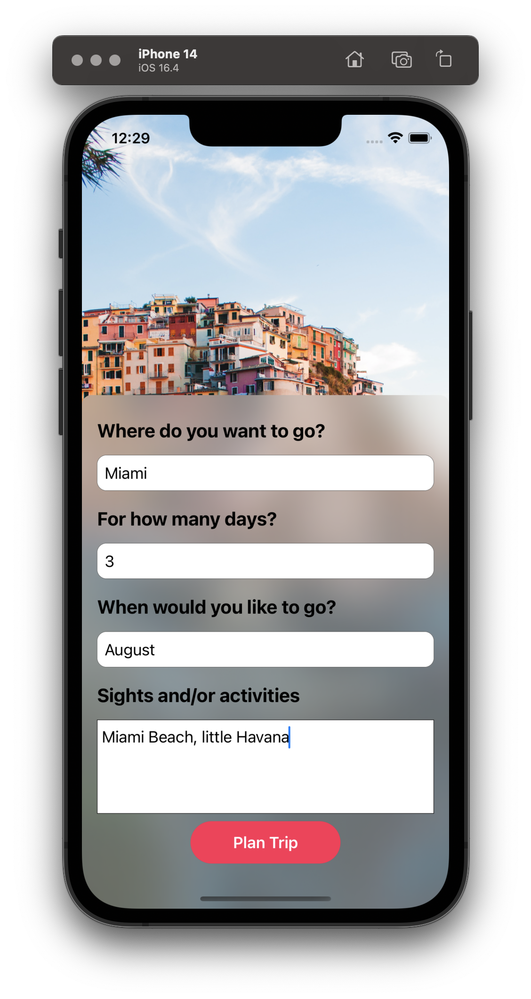

# TRAVaiL - an AI Trip Planner app

## Description

This app is designed to utilize ChatGPT to build and recommend a trip itinerary based on user inputs.

## Details

* Getting structured data returned from ChatGPT requires the use of Function Calls. This is different from using Chat Completion which only returns a single string.
* Function Calls are used to create structured response data from ChatGPT. In this app, the structured data is just displayed back to the user, but it can also be used as parameters to make additional function calls, thus the reason it is called Function Calls.
* Even with a structured data schema, the response is often unpredictable and may or may not contain all of the requested data.

## Screenshots

